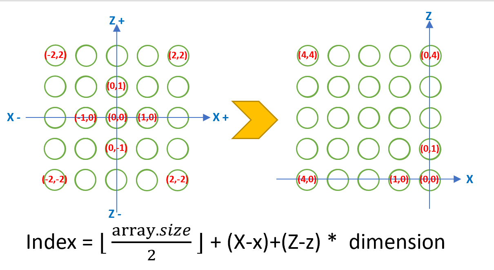
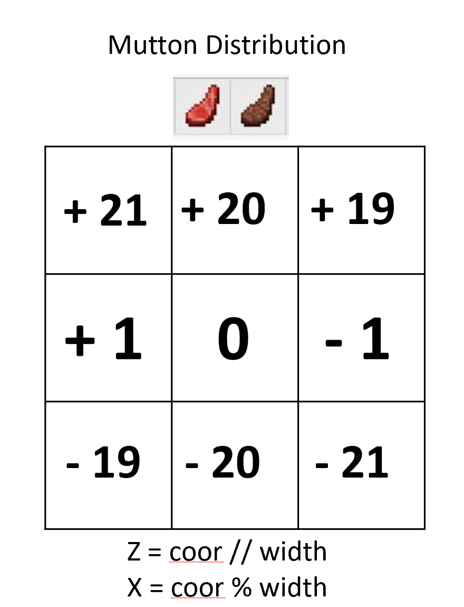

### Video Summary

### Project Summary

### Approach
#### Environment/ Minecraft Map
length: 20  
width: 50  
stained glass wall: 3  
<br />  

#### Reward System
Carrot: +5  
Cooked_mutton: -1  
Mutton: -2  
<br />

#### Actions of agent
1. Action 0: Move forward for 1 block.
2. Action 1: Turn 1 which is 90 degrees to the right
3. Action 2: Turn -1 which is 90 degrees to the left
4. Action 3: Jump
<br />

#### Machine Learning Algorithms
##### Convert data
<div style="text-align:left;">

</div>
We solved the problem of converting the observation API into a grid location around the agent Jackson. The above image shows the conversion formula we used. Get_observation function uses the observation API to get items around the agent(5 * 5) and returns the values of x, y, z. Since it is the same plane, the y value is the same. We successfully converted each x, z coordinate into a corresponding index. Here is our code below. For example, our agent Jackson is now at (2, 1), and item is at (3, 2), his observation 5 * 5 = 25. In our formular, the upper case "X" and "Z" represent item location and lower case 'x' and 'z'represent agent location. We need to get half of the floor of array.size, that is, the integer obtained by dividing the square of our observation size by 2. 
```math
index = self.obs_size * self.obs_size // 2 + (int)(item['x'] - agent['x']) + (int)(item['z'] - agent['z']) * self.obs_size
```
<br />

##### Mutton Distribution 
<div style="text-align:left;">

</div>
<br />

##### Set Carrot Path
<div style="text-align:left;">

</div>
<br />


### Evaluation

***Qualitative:***

<br />

***Quantitative:***

<br />


### Resources Used
