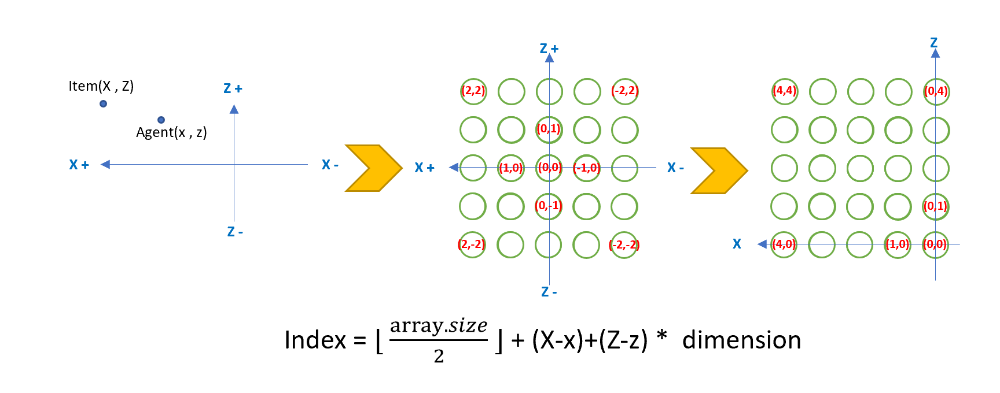
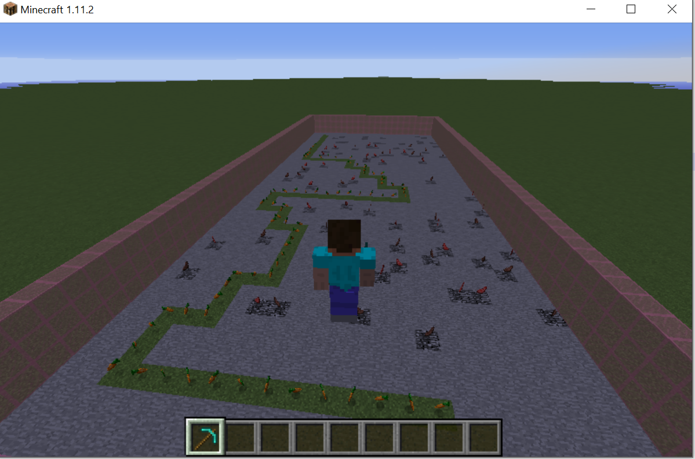
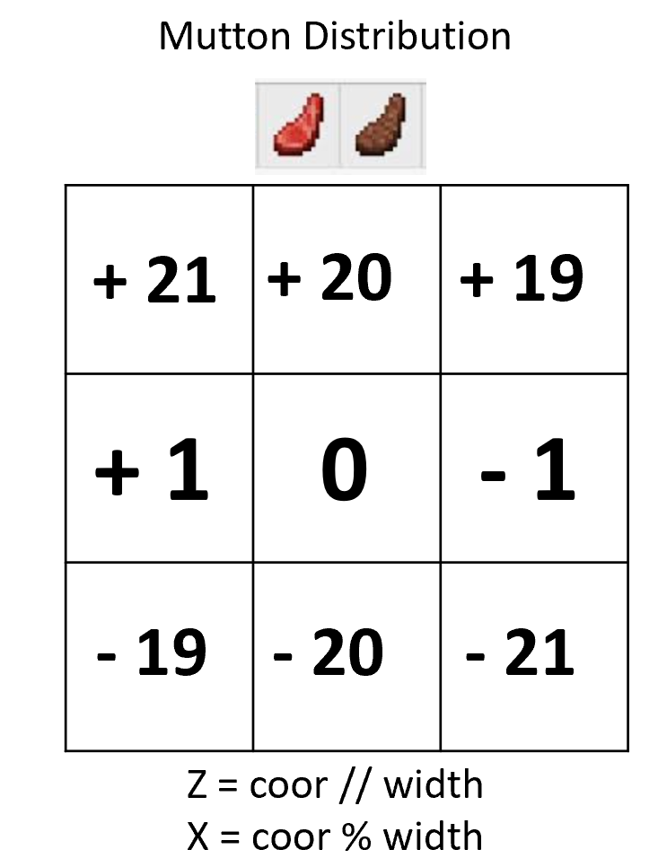
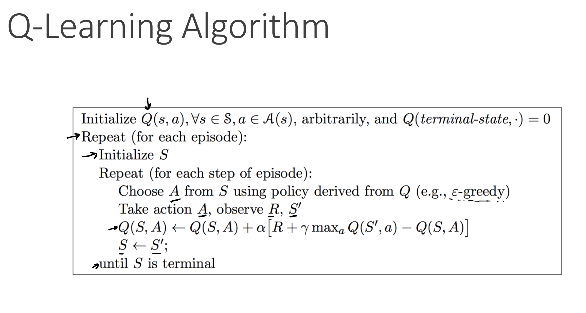
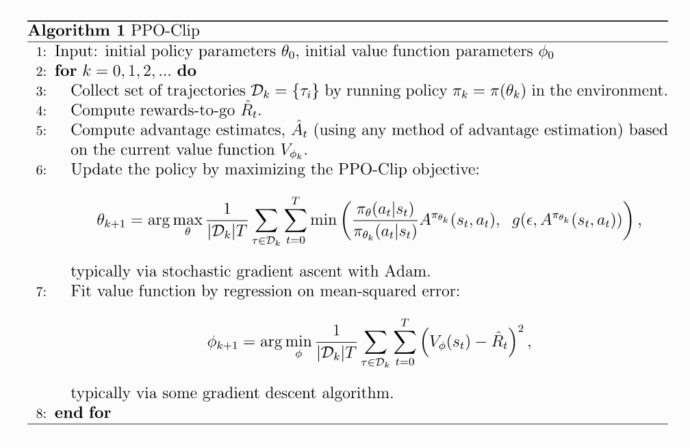
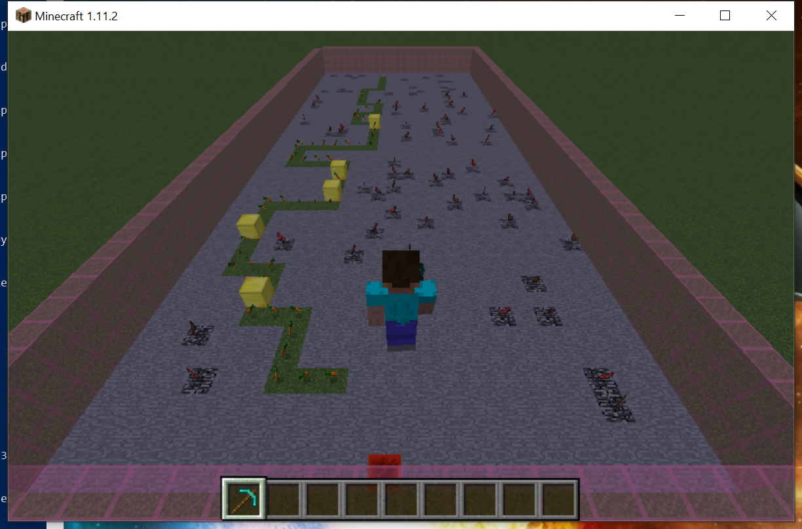
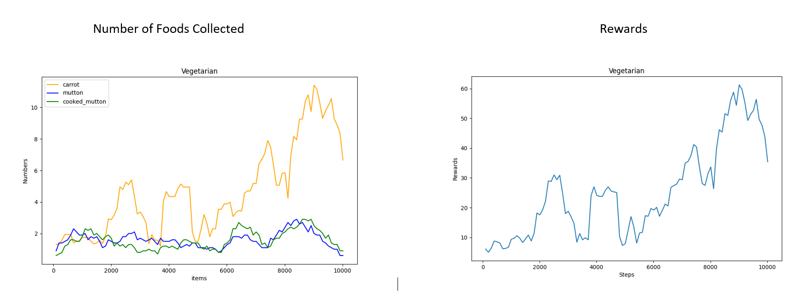
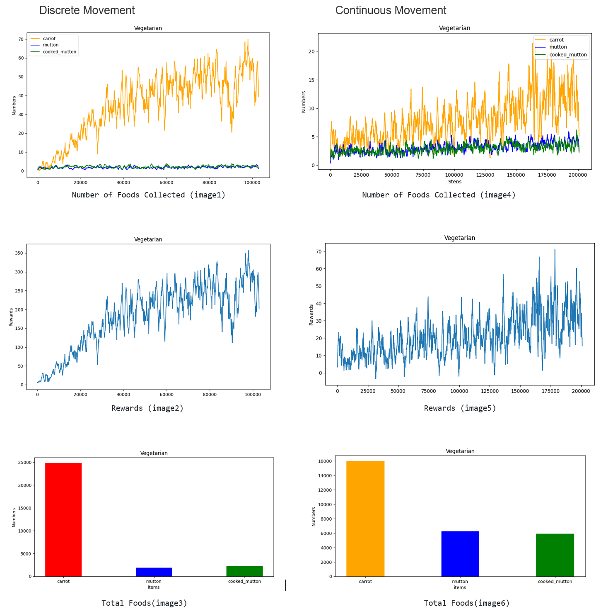

### Video Summary

### Project Summary
The purpose of our project is to let the vegetarian Jackson pick up more carrots instead of mutton. For Jackson having a good learning environment, we built a 20 * 50 rectangular map with three layers of pink stained glass wall for Jackson to explore. We randomly generated a carrot path and with mutton surrounded in the map. In order to get more rewards, Jackson needs to walk along the "carrot path" and pick up carrots as much as possible to avoid picking up mutton. Our project is similar to the current artificial intelligence navigation system and the "carrot path" is the correct route in our daily life. At the same time, we also verified that under the PPO algorithm, the use of discrete movement command methods can make the agent learn more efficiently and achieve more rewards.  
  
Compared with the previous version, we have made a huge change. First, we changed the distribution of the "carrot path". We have changed the map more rationally and more in line with real life. For more details, please see "2. Set Carrot Path" in the Machine Learning Algorithms section. Since sometimes, the mutton is next to the carrot, we saw that Jackson would pick up the carrot with mutton even he did not touch it. We add Mutton Distribution Algorithm to avoid they close to each other. Secondly, Jackson's observations have also changed. Jackson does not learn by observing blocks or floors mechanically. Instead, he will be smarter to observe dynamically generated food. We solved the problem of converting the observation API into a grid location around the agent Jackson To facilitate Jackson to observe carrot and mutton directly. In order to report the quantitative results more clearly, we have also added other graphs such as the number of picks for carrots and muttons respectively.   
  
At the beginning, we used the Q-learning algorithm to solve the problem. Compared with PPO, instability is the biggest problem of Q-learning algorithm. We found that using the Q-learning algorithm would make Jackson hesitate and waste a lot of time at the turning point of the "carrot path". Even if we changed the observation space algorithm, Jackson's rewards still did not improve significantly. After discussion with Kolby, we finally decided to use PPO (Proximal Policy Optimization) with RLlib and Ray to train the agent in a random environment.  
  
Finally, we tried to set obstacles on the "carrot path" and added the action "Jump". We wanted Jackson to be able to wisely skip(/jump) mutton if it deviates from the "carrot path". When Jackson was on the "carrot path", he was able to jump over obstacles wisely. But through observation, most of the time Jackson just jumped randomly and bypassed blocks and muttons, which did not meet our expectations.  
<br />   
### Approach
#### Environment/ Minecraft Map
length: 50  
width: 20  
stained glass wall: 3
max carrot amount: 100  
max mutton amount: 100  
<br />  

#### Reward System
Carrot: +5  
Cooked_mutton: -1  
Mutton: -2  
<br />

#### Actions of agent
1. Action 0: Move forward for 1 block.
2. Action 1: Turn 1 which is 90 degrees to the right
3. Action 2: Turn -1 which is 90 degrees to the left
<br />

#### Machine Learning Algorithms
##### ***1. Convert data***
<div style="text-align:left;">

</div>  

We changed Jackson's observation space. Rather than Jackson simply observing the grass block that has been generated which does not move, we changed the way of observation . Jackson can directly observe carrots and muttons during the learning process. Compared with observing the grass block directly, the difficulty of observing the carrot directly is that the grass block will not change. However, the carrot will disappear after being picked up by Jackson. We solved the problem of converting the observation API into a grid location around the agent Jackson. The above image shows the conversion formula we used. Get_observation function uses the observation API to get items around the agent(5 * 5) and returns the values of x, y, z. Since it is the same plane, the y value is the same. We successfully converted each x, z coordinate into a corresponding index. In our formular, the upper case "X" and "Z" represent item location and lower case 'x' and 'z'represent agent location. Here is our code below. 
  
```
        array index = middle index of the observation array + (item X - agnet X) + (item Z - agnet z) * observation diameter
```

For example, our agent Jackson is now at location of our map (12, 31), and item is at location of our map (13, 32), his observation 5 * 5 = 25. Firstly, we consider Jackson at location (0,0) in our observation map(show left above). We need to get half of the floor of array.size, that is, the integer obtained by dividing the square of our observation size by 2. We can get Index = 5 * 5 //2 + (13 - 12) + (32 - 31) * 5 = 18. Finally, it will be saved as an array.
<br />

##### ***2. Set Carrot Path***  
The picture below is the "carrot path" we set randomly. We randomly generate carrots in the forward grid, left or right grids after setting the first carrot. In order to make Jackson rotate less frequently, I generate 2-4 carrots continuously at the position where the next carrot is randomly generated. Since our map is long and narrow, we will make the carrots in the forward grid more than left or right grids when randomly generated. As usual, we will do a border check to prevent randomly generated carrots from being outside the map.

<div style="text-align:left;">

</div>
<br />

```   
        # Carrot Distribution
        while until reached the max corrot amount or reached the forward wall
          randomly choose(left, right, forward)
          if the random coordinate is valid
            if left or right direction:
              step = 2
            else
              step =  randomly choose(3 or 4)

            append the coordinate to the carrot list
            
```  
<br />
  
##### ***3. Mutton Distribution***  
In order to give Jackson a penalty, we set up a mutton next to the "carrot path". If Jackson, a vegetarian, picks up mutton, he will deduct points. Because the map we set up is 20* 50. In order to ensure that mutton and carrot do not appear on the same grid, we check the surrounding grids before setting up the mutton. As you can see in the image below. We take mutton as the center and confirm that no carrots will be placed on the eight grids around it which indices are -21, -20, -19, -1, +1, +19, +20, +21. This prevents mutton and carrot from appearing on the same grid. In addition, we will also pay attention to the ratio of mutton to carrot. We make sure that mutton will not be too much and the agent will lose a lot of points. We will also ensure that there are too few muttons so that the agent has no chance to encounter mutton and cannot learn. Therefore, when we set the ratio of the number of muttons to the number of carrots to be same, the distribution of muttons is the best.
  
<div style="text-align:left;">

</div>  
Here is our code for setting the mutton.  
<br />  
```    
        # Mutton Distribution   
        while until reached the max meat amount
          get a random coordinate
          if the random coordinate is not next to any carrot
            append the coordinate to the meat list

        repeat for each coordinate in the meat list
          randomly choose meat type(the cooked or uncooked meat type)
            
```  
<br />
  
##### ***4. Q-learning***  

<div style="text-align:left;">

</div>
(source: image refer from our lecture 8 notes)

S: current state <br>
A: current action <br>
Q(S, A): old values <br>
$$\alpha:$$ learning rate <br>
R: rewards <br>
$$\gamma:$$ discount factor <br> 
$$\max_a Q(S,a):$$ slightly estimate of optimal future value <br>

<br/>
We have tried using Q-learning, but it is not very stable from Jackson's results. We found that the Q-learning algorithm did not greatly improve Jackson's score. Through a lot of time learning, Jackson still has no obvious improvement after 100,000 steps. In observing Jackson's learning process, we found that it sometimes pauses when making decisions, which may also waste its learning time. After discussion with Kolby, we decided to use PPO (Proximal Policy Optimization) with RLlib and Ray to train the agent in a random environment.
<br />
  
##### ***5. Proximal Policy Optimization (PPO)***  
PPO trains a random strategy in a strategy-based manner, which can be updated in small batches in multiple training steps, and then the best strategy can be selected through the strategy. This means that it will explore through sampling operations based on the latest version of its random strategy. PPO is the built-in trainer of RLlib, which solves the problem of difficult to determine the step length. The PPO used in our project is a strategy-based algorithm that can only be trained using the data generated by the currently optimized strategy. When Jackson uses a piece of data (status, action, reward, new status), after updating the parameters of the strategy network, the "optimization" strategy will be changed immediately. We all know that the randomness of action selection depends on initial conditions and training procedures. During the training process, PPO usually becomes less and less random as the updated rules encourage the strategy to take advantage of discovered rewards. This may cause the strategy to fall into a local optimal state. Below we provide the Pseudocode of PPO.

<div style="text-align:left;">

</div>
<br />
  
Compared with Q-learning, PPO provides more stable results, but requires more training steps. We did a comparison between using continuous movement and discrete movement and found that in some cases, when the agent should stop moving for one second, it still moves. Therefore, we decided to switch to discrete motion. Discrete exercise can significantly increase our training speed, because we have to train more episodes at the same time.
  
##### ***6.Action：Jump***
<div style="text-align:left;">

</div>    
    
<br />
Just like the map I gave above, we randomly set up gold blocks on the "carrot path" to hinder Jackson. Our initial idea was that Jackson could learn to skip blocks and muttons in order to get higher scores. We expect Jackson to jump over obstacles on the carrot path and keep on the path. If Jackson deviates from the carrot path, he can jump over muttons, which is a good way to avoid picking up mutton and losing points. In fact, after we let Jackson learn 100,000 steps, it still did not meet our expectations. Through observation, we found that in most cases, Jackson jumps randomly when walking. It does effectively jump over blocks a few times, but most of times, Jackson just passby the blocks and muttons and will not follow the carrot path correctly. Taking into account the lack of rapid improvement in rewards and Jackson's limited learning ability, we decided to delete Jackson's jump action.
<br />
### Evaluation

***Qualitative:***
<div style="text-align:left;">
  
</div>   
  
To evaluate Jackson's performance, we simply need to observe the number of carrots and muttons picked up. By observing the changes in rewards, we can easily find that Jackson’s rewards have improved significantly at about 6,500 steps. Comparing the images of the picked items on the left above, we can also find that the number of carrots picked up is almost the same as the number of muttons before about 6,500 steps, and the three lines are very close. After 6,500, the number of carrots which Jackson picked up increase rapidly. The orange curve representing carrots that Jackson picked up is different from the other two mutton curves and it starts to rise slowly. This proves that Jackson has made progress in the learning process and realizes that he needs to pick up more carrots to get more rewards.
<br />

***Quantitative:***  
<div style="text-align:left;">

</div>
<br />
Comparing with status, we also tested Jackson's discrete movement rewards. Jackson still gets a +5 bonus point for every carrot he picks up. When he meets Cooked_mutton and mutton, his penalties are -1 and -2 respectively. From Rewards (image2), it can be clearly seen that rewards have been increasing rapidly until 40,000 steps. It starts to rise slowly after then. In addition, in order to more intuitively reflect Jackson's progress, we also plotted the discrete movement to record the number of the carrots and muttons picked up by Jackson in each episode in image 1. At the same time, we also recorded the total number of carrots and the number of muttons in 100,000 steps.    

In status, we use a small amount of data (50,000 steps) to guess that Jackson can learn more efficiently and get higher scores under discrete movement than continuous movement. In order to verify our conjecture, we collected a lot of data (100,000 steps at least). We recorded 100,000 steps in discrete movement and compared Jackson 200,000 steps in continuous movement. From image 3 and image 6, it can be clearly contrasted that even if the data collected by continuous movement is twice that of discrete movement, the carrot collected by Jackson is much smaller than that in discrete movement. By observing image 5, we can tell that rewards slowly increase at the same speed under continuous movement. Image 4 also reflects the same problem. The orange curve, representing the number of carrots collected, is very close to the other two representing mutton. Under the PPO algorithm, discrete motion allows Jackson to learn more efficiently and make rapid progress.
### Resources Used

- [Malmo XML Schema Documentation](https://microsoft.github.io/malmo/0.14.0/Schemas/Mission.html)
- [Malmo XML template](https://canvas.eee.uci.edu/courses/34142/quizzes/144375)
- [RL — Proximal Policy Optimization (PPO) Explained](https://jonathan-hui.medium.com/rl-proximal-policy-optimization-ppo-explained-77f014ec3f12)
- [PPO Pseudocode](https://spinningup.openai.com/en/latest/algorithms/ppo.html#proximal-policy-optimization)
- [RLlib Algorithms](https://docs.ray.io/en/master/rllib-algorithms.html#proximal-policy-optimization-ppo)
- [Q-Learning Wiki](https://en.wikipedia.org/wiki/Q-learning)
- [Simple Reinforcement Learning:Q-learning](https://towardsdatascience.com/simple-reinforcement-learning-q-learning-fcddc4b6fe56)
- [Q-Learning Algorithm](https://towardsdatascience.com/a-beginners-guide-to-q-learning-c3e2a30a653c)
