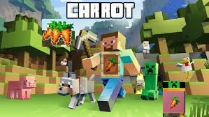

### Introduction
  
Jackson, as a carrot lover, wants to collect as many carrots as possible on his path. As a vegetarian, Jackson wants to pick up more carrots.  
He hates eating meat, especially raw meat. When encountering carrots, his reward score will increase. On the contrary, when encountering meat,  
he will lose reward scores. Jackson continued to explore the map and started his journey of collecting carrots.

### Source code
[https://github.com/kaviochen/Vegetarian](https://github.com/kaviochen/Vegetarian)

### Reports:

- [Proposal](https://kaviochen.github.io/Vegetarian/proposal.html)
- [Status](https://kaviochen.github.io/Vegetarian/status.html)
- [Final](https://kaviochen.github.io/Vegetarian/final.html)

### Team Members 
[Team member details](https://kaviochen.github.io/Vegetarian/team.html)

### Weekly Meeting

We meet twice a week from 09:00pm - 10:00pm (Pacific Time - US & Canada) on Wednesday and Sunday through zoom.  
On Sundays, we assign each one what we need to do next week and on Wednesdays we discuss and help each other.

### References
- [Markdown and format](https://github.com/mundimark/quickrefs/blob/master/HTML.md)
- [Rewards of foods](https://minecraft.gamepedia.com/Food)
