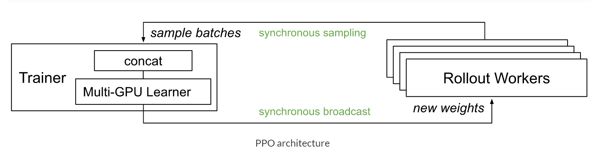
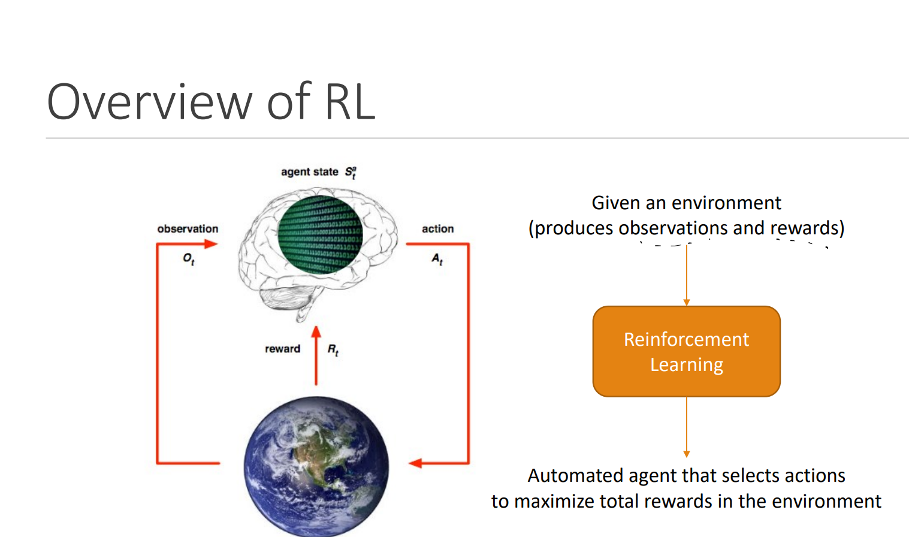
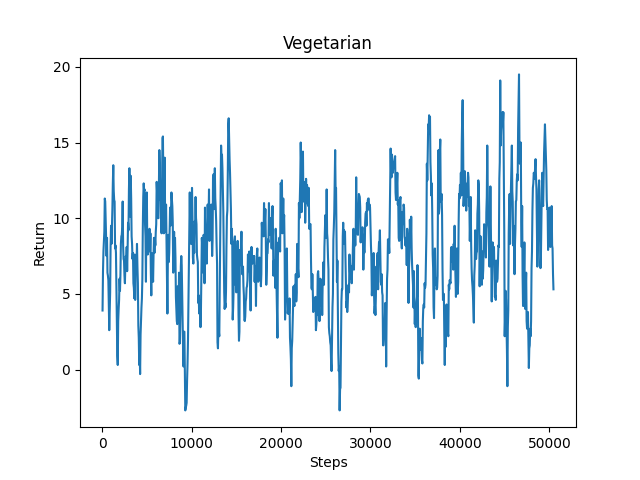
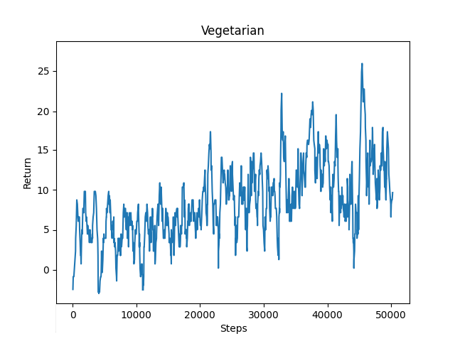

### Video Summary

<iframe width="560" height="315" src="https://www.youtube.com/embed/sRbSulbb9Xo" frameborder="0" allow="accelerometer; autoplay; clipboard-write; encrypted-media; gyroscope; picture-in-picture" allowfullscreen></iframe>  
 

[Video link](https://youtu.be/sRbSulbb9Xo)
 
### Project Summary

The original idea of our group was that Jackson could walk different paths from the starting point (emerald_block) to the end point (redstone_block). During the journey, he will try to pick up different foods representing different reward scores and or the highest score. With the in-depth study of AI algorithms, we decided to make our project more challenging. Compared with proposal, we made some changes and confirmed more detailed rules. Jackson, as a vegetarian, wants to get more carrots. He will explore on a 20 * 50 size map and wants to collect more carrots. At the same time, he also hates meat, especially raw meat. In our project, we defined the reward score of the system. According to Jackson's preferences, we set Jackson to get +5 reward scores when he collects carrots. When he touches meat, Jackson will get -1 reward scores. What's worse is that when he touches raw meat, he will get -2 reward scores. This means that Jackson can only go to the adjacent grid in order to get consecutive carrots to get the highest score. Jackson will stop if he has collected all the carrots.

### Approach
#### Environment/ Minecraft Map
length: 20  
width: 50  
stained glass wall: 3  
   

#### Reward System
Carrot: +5  
Cooked_mutton: -1  
Mutton: -2  
 

#### Actions of agent
1. Action 0: Move forward for 1 block.
2. Action 1: Turn 1 which is 90 degrees to the right
3. Action 2: Turn -1 which is 90 degrees to the left
 

#### Machine Learning Algorithms
According to assignment 2, we used the on-policy algorithm Proximal Policy Optimization(PPO). PPO is a new objective function can be updated in multiple training steps in small batches, and then the best strategy can be selected through this strategy. PPO is a built-in trainer of RLlib, it solves the problem of difficult to determine the step length. 

The PPO used in our project is an on-policy algorithm, which can only use the data generated by the currently optimized policy for training. When Jackson uses a piece of data (state, action, reward, new_state), after updating the parameters of the policy network, the "optimizing" policy immediately changes. Therefore, we need to use it to generate a new piece of data, and then continue the subsequent training, and the piece of data we just used for training has been "outdated" and cannot be used anymore and needs to be discarded.  

The idea of PPO comes from the similar idea of reinforcement learning in lecture. From the mind map below, we can understand that Jackson can pick up food as he explores the map. In this environment, different foods represent different rewards and feedback to Jackson. Jackson can observe and optimize and then decide his next move. In Jackson's study, he will repeat the above steps and update the policy.  

### Evaluation

***Qualitative:***
Vegetarian Jackson wants to get more carrots. From the midpoint of the length of the map as the starting point, "move" and “turn” actions. In the beginning, Jackson moved and turned randomly on the map. Through observation of Jackson, he mostly walked towards the wall. After a period of study, Jackson knew to move in the direction of food and rarely hit the wall. After 20,000 steps, Jackson obtained a higher reward score and the score tended to improve.
 

***Quantitative:***
We tested Jackson's discrete and continuous movement reward scores respectively. From the graphs, we can find that the discrete relatively obtains a higher reward score. Below we can see the Jackson's reward scores. Jackson gets a +5 reward scores every time he gets a carrot, and when he encounters Cooked_mutton and mutton, he has a penalty of -1 and -2 respectively. Through the icon, we found that Jackson's score fluctuated up and down. This may be a random map that prevented Jackson from finding other ways to improve the reward score.
 

#### Continuous Movement

#### Discrete Movement

  

### Remaining Goals 
We are trying to add a judgment to the algorithm when Jackson faces to a stained glass wall. Jackson will turn the opposite direction and try to return to the ‘carrot’ route to collect carrots. This can effectively reduce the pre-learning time and improve efficiency. At the same time, we also try to make Jackson realize faster if he picks up Cooked_mutton or mutton, it means he has moved away from the ‘carrot’ route. He needs to find and return to the ‘carrot’ route. We still need to improve Jackson's rotation accuracy so that he does not waste time by rotating randomly on the map. In order to increase the difficulty. We intend to add obstacles such as rocks. At the same time, Jackson will also have a new action ‘Jump’. He needs to decide whether he needs to jump over obstacles. As the difficulty increases, near the end of the ‘carrot’ path, I will set a small amount of golden_carrot. He will be worth 50 reward scores, which is higher than ordinary carrots.

### Challenges
Currently, Jackson has not improved significantly after a period of study. It may be that Jackson did not learn enough steps. We are also trying to use Q-learning to improve Jackson's reward score, but not sure whether it can improve scores a lot. We found that Jackson hardly picked up all the carrots and sometimes wasted time by spinning randomly on the map. We don't know how to make Jackson pick up all the carrots in a limited time. We are still studying whether different algorithms are suitable for different movement styles. In other words, whether discrete and continuous movements change the efficiency of Jackson learning due to different algorithms. In addition, we found that get_observation function uses the observation API to get items around the agent(5 * 5). It returns the  x, y, z location, however, we need to convert these data into grid location around the agent. If we get stuck we might ask our TA Kolby for some advice or implementation strategies.

### Resources Used

- [Malmo XML Schema Documentation](https://microsoft.github.io/malmo/0.14.0/Schemas/Mission.html)
- [Malmo XML template](https://canvas.eee.uci.edu/courses/34142/quizzes/144375)
- [RL — Proximal Policy Optimization (PPO) Explained](https://jonathan-hui.medium.com/rl-proximal-policy-optimization-ppo-explained-77f014ec3f12)
- [RLlib Algorithms](https://docs.ray.io/en/master/rllib-algorithms.html#proximal-policy-optimization-ppo)
- [Q-Learning Wiki](https://en.wikipedia.org/wiki/Q-learning)
- [Simple Reinforcement Learning:Q-learning](https://towardsdatascience.com/simple-reinforcement-learning-q-learning-fcddc4b6fe56)
- [Q-Learning Algorithm](https://towardsdatascience.com/a-beginners-guide-to-q-learning-c3e2a30a653c)
